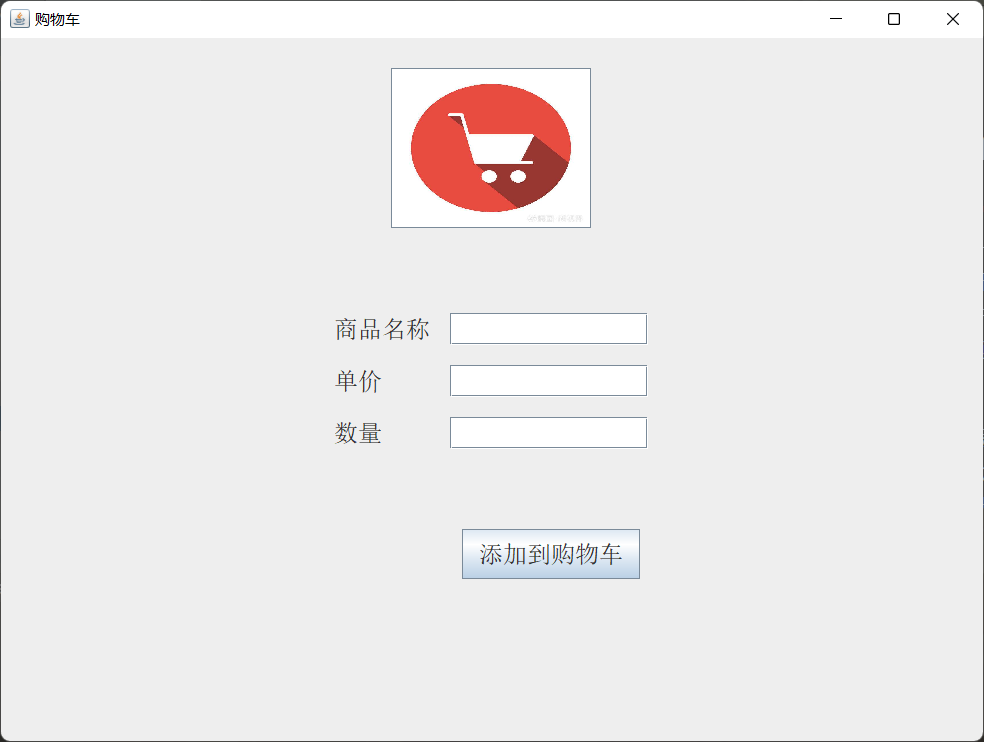
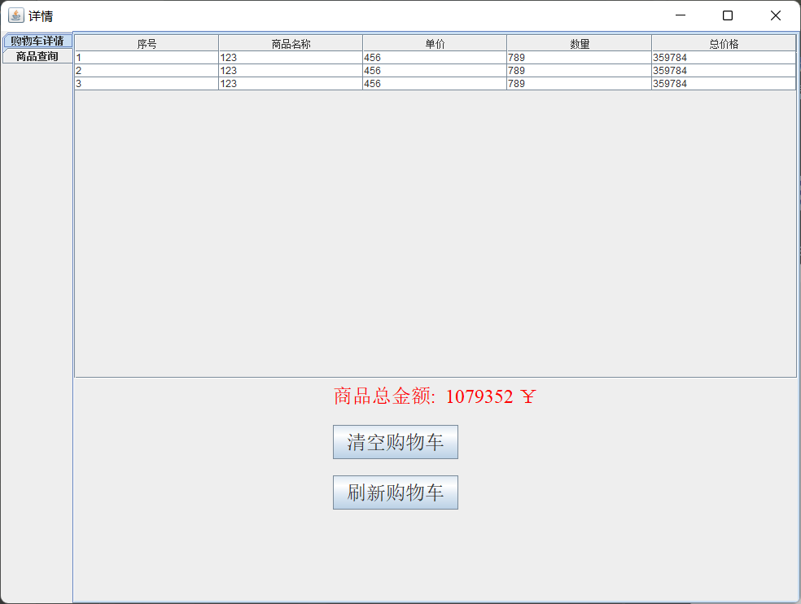

友情连接： [使用邮箱实现进程通信](https://github.com/goldthree-shit/os_mailbox)
# shoppingcart-swing
使用JAVA-Swing的，网上超市购物车功能模拟。\
使用Java语言编写一个模拟网上超市购物结算功能的程序，要求 程序运行后有一个图形用户界面，可供用户输入购买的各种商品相关信息，最后给出用户的购物清单及价格，并且用户可以根据需要查询自己购买的第几项商品的详细信息。\
需求分析：
- 1. 用户可以添加购买一种商品，添加的信息包括商品名称、数量和单价 
- 2. 用户可以删除已购买的一种商品 
- 3. 用户可以查询已购买的一种商品的详细信息，查询时要指明查询的商品的记录号是多少（商品记录号是按照商品购买次序编的），还可以指定查询第一个或最后一个购买的商品信息。
- 4. 用户可以删除所有已添加到购物车的商品
- 5. 所有产品信息数据保存在文件中
    
# 使用说明：
- 文件数据的保存与加载，无需手动保存和导入。读入发生在启动时，保存事件发生在主窗口关闭时，所以注意加入重启程序会导致数据无法保存，需要手动关闭程序后在启动。
- 在主启动类 Main 中启动main函数即可\
该窗口对应 IndexWindow
点击左上角的 × 会进行数据的保存 

- 然后点击中心的购物车图标 \
该窗口对应 DetailWindow， 下面的两个子页面对应page包中的页面 \
  点击 左上角的 × 之后又会弹回到主页面

